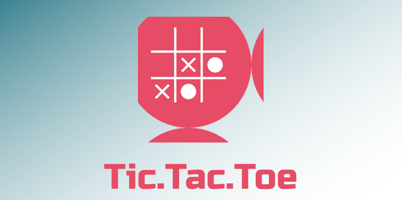

# <b>Tic-Tac-Toe</b>



> "Share your knowledge. It’s a way to achieve immortality."

---

### <b>Table of Contents</b>

- [Description](#<b>Description</b>)
- [How To Use](#<b>how-to-use</b>)
- [Author Info](#<b>author-info</b>)
- [References](#<b>references</b>)
- [License](#<b>license</b>)

---

## <b>Description</b>

This project is a network-based Tic-Tac-Toe application required as the final project of Java course as part of the 9-month training program provided by the Information Technology Institution (ITI).

#### <b>Features</b>
- Single Player Mode:
    - This mode has 3 difficulty levels implemented using the <b>Minimax Algorithm</b>
        - [Wikipedia - Minimax.](https://en.wikipedia.org/wiki/Minimax​)
        - [Minimax Algorithm in Game Theory.](https://www.geeksforgeeks.org/minimax-algorithm-in-game-theory-set-1-introduction/)
        - Special thanks to [The Coding Train](https://www.youtube.com/channel/UCvjgXvBlbQiydffZU7m1_aw) Youtube page for explaining the algorithm in this [video.](https://www.youtube.com/watch?v=trKjYdBASyQ&t=917s&ab_channel=TheCodingTrain)

- Two Player Mode:
    - This mode features a game mode where two players on the same device can challenge each other.

- Multiplayer Mode:
    - This mode features a game mode where players among different devices or networks can play together if the server is up and running to recieve connections.

- Replay Mode:
    - In this mode if you have the database installed on your device, the games can be saved and can be accessed later using your name.

#### <b>Technologies</b>

- Java
- Javafx
- MySQL

[Back To The Top](#<b>Tic-Tac-Toe</b>)

---

## <b>How To Use</b>

#### <b>Prerequisites</b>
1. Before running the JAR files you need to have Java installed on your machine. You can check whether you have Java installed or not by running the following command in the shell (linux/windows):

```
java -version
```

- If you have Java installed then <b><i>java version "x.x.x.x"</i></b> will be displayed, if not you can follow this those links for Java installation:
    - [Install Java on Linux](https://opensource.com/article/19/11/install-java-linux)
    - [Install Java on Windows](https://www.guru99.com/install-java.html)

2. You also need to have MySQL if you want to record your games, you can follow these links for installation guide:
    - [Install MySQL on Linux](https://docs.rackspace.com/support/how-to/install-mysql-server-on-the-ubuntu-operating-system/)
    - [Install MySQL on Windows](https://www.liquidweb.com/kb/install-mysql-windows/)

3. After installing MySQL you can import the database using the `TicTacToeSQL.sql `file in the SQL directory or download from [this SQL file.](https://drive.google.com/file/d/1oQ0jXTxygBVLUtrKxozrg9yTnZgcu9yY/view?usp=sharing)
    - For more information on how to import database you can visit [this link](https://stackoverflow.com/questions/15884693/how-can-i-import-data-into-mysql-database-via-mysql-workbench).

#### <b>Configuarations</b>
1. To configure the network information go to `src/helpers/NetworkConfig.java` and add the IP address and the port number in the variables respectively.
```java
public static final String SERVER_HOST_IP = "127.0.0.1";
public static final int PORT_NUMBER = 1234;
```

2. To configure the database go to `src/helpers/DatabaseConfig.java`
```java
// This is the URL for the database, replace the "tictactoe" with the name you gave your schema
public static final String DB_URL = "jdbc:mysql://localhost:3306/tictactoe";

// Insert your MySQL database username
public static final String DB_USERNAME = "XXX";

// Insert your MySQL database password
public static final String DB_PASSWORD = "XXX";
```
<b>Congratulations you are now ready to play the game using the JAR files!</b>
-
<br>


#### <b>Running the game</b>
- Double click on `Game.jar` found in `/JAR files` directory.

- If you want to use the Multiplayer Mode you need to double click on the `Server.jar` first then turn the server on.

- You can run the jar files from the command line using the following commands:
```
java -jar "Game.jar"
java -jar "Server.jar"
```

[Back To The Top](#<b>Tic-Tac-Toe</b>)

---

## <b>Author Info</b>

- Omar Yehia Ahmed - [Facebook Page](https://www.facebook.com/ramo.yehia)
- Abdelrahman Yasser Atta - [Facebook Page](https://www.facebook.com/abdelrhman.yasser)
- Karim Ahmed Arafa - [Facebook Page](https://www.facebook.com/profile.php?id=1808863929)
- Mahmoud Mohammed Ahmed - [Facebook Page](https://www.facebook.com/profile.php?id=100001785838998)

[Back To The Top](#<b>Tic-Tac-Toe</b>)

---

## <b>References</b>

Special thanks to all the developers our there who share their knowledge for us to learn and spread.

The videos used in this project were created by fellow ITI members who used them in their project, so thanks to every one of them [Nouran Samy - Ahmed Mamdouh - Ahmed AbdelHamid - Hagar Abdou  - Sara Yasser]

[Back To The Top](#<b>Tic-Tac-Toe</b>)

---

## <b>License</b>

MIT License

Copyright (c) [2021] [Omar Yehia - Karim Arafa - Abdelrahman Atta - Mahmoud Mohammed]

Permission is hereby granted, free of charge, to any person obtaining a copy
of this software and associated documentation files (the "Software"), to deal
in the Software without restriction, including without limitation the rights
to use, copy, modify, merge, publish, distribute, sublicense, and/or sell
copies of the Software, and to permit persons to whom the Software is
furnished to do so, subject to the following conditions:

The above copyright notice and this permission notice shall be included in all
copies or substantial portions of the Software.

THE SOFTWARE IS PROVIDED "AS IS", WITHOUT WARRANTY OF ANY KIND, EXPRESS OR
IMPLIED, INCLUDING BUT NOT LIMITED TO THE WARRANTIES OF MERCHANTABILITY,
FITNESS FOR A PARTICULAR PURPOSE AND NONINFRINGEMENT. IN NO EVENT SHALL THE
AUTHORS OR COPYRIGHT HOLDERS BE LIABLE FOR ANY CLAIM, DAMAGES OR OTHER
LIABILITY, WHETHER IN AN ACTION OF CONTRACT, TORT OR OTHERWISE, ARISING FROM,
OUT OF OR IN CONNECTION WITH THE SOFTWARE OR THE USE OR OTHER DEALINGS IN THE
SOFTWARE.

[Back To The Top](#<b>Tic-Tac-Toe</b>)

---


